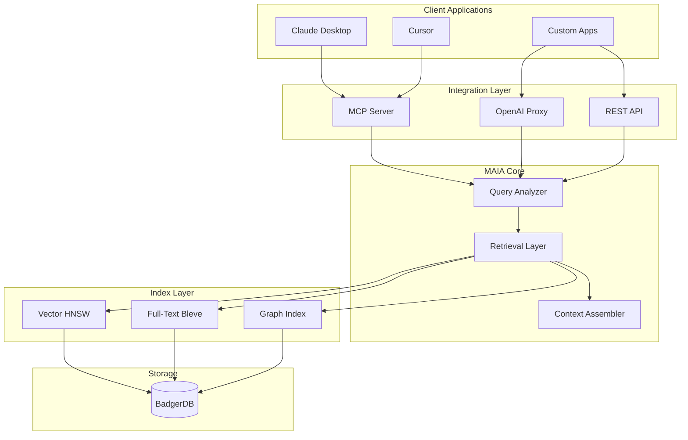

# MAIA

**Memory AI Architecture** — An AI-native distributed memory system for LLM context management

<div class="grid cards" markdown>

-   :material-rocket-launch:{ .lg .middle } __Getting Started__

    ---

    Install MAIA and run your first queries in minutes

    [:octicons-arrow-right-24: Installation](getting-started.md)

-   :material-cog:{ .lg .middle } __Configuration__

    ---

    All configuration options explained with examples

    [:octicons-arrow-right-24: Configuration](configuration.md)

-   :material-api:{ .lg .middle } __API Reference__

    ---

    Complete REST API documentation

    [:octicons-arrow-right-24: API Reference](api-reference.md)

-   :material-code-tags:{ .lg .middle } __SDKs__

    ---

    Go, TypeScript, and Python client libraries

    [:octicons-arrow-right-24: SDKs](sdks.md)

-   :material-robot:{ .lg .middle } __MCP Integration__

    ---

    Connect Claude Desktop or Cursor

    [:octicons-arrow-right-24: MCP Integration](mcp-integration.md)

-   :material-kubernetes:{ .lg .middle } __Deployment__

    ---

    Docker, Kubernetes, and production setup

    [:octicons-arrow-right-24: Deployment](deployment.md)

</div>

---

## What is MAIA?

MAIA is an **intelligent context management system** that sits between your application and LLMs. Instead of fighting context window limitations, MAIA intelligently manages what information goes INTO that window.

### The Problem

LLMs have limited context windows. Current solutions either:

1. **Truncate** context (losing important information)
2. **Summarize** context (losing nuance and detail)
3. **Use basic RAG** without position awareness (suboptimal retrieval)

Research shows that LLM accuracy varies by **20-30%** based on where information appears in the context—a phenomenon known as "context rot."

### The MAIA Solution

MAIA provides **position-aware context assembly** that:

1. **Understands query intent** to retrieve the most relevant memories
2. **Scores memories** using multi-strategy retrieval (vector + text + graph + recency)
3. **Assembles context** with position-aware ordering (critical info first, recent info last)
4. **Optimizes for token budget** constraints automatically

---

## Key Features

### Position-Aware Context Assembly

MAIA organizes context into strategic zones:

```
┌─────────────────────────────────────────┐
│  CRITICAL ZONE (15%)                    │  ← High-relevance facts (score ≥ 0.7)
│  Most important information first       │
├─────────────────────────────────────────┤
│  MIDDLE ZONE (65%)                      │  ← Supporting context
│  Decreasing relevance, detailed info    │
├─────────────────────────────────────────┤
│  RECENCY ZONE (20%)                     │  ← Recent/temporal context
│  Working memory, recent interactions    │
└─────────────────────────────────────────┘
```

### Multi-Strategy Retrieval

MAIA combines multiple retrieval strategies for optimal results:

| Strategy | Weight | Purpose |
|----------|--------|---------|
| Vector Similarity | 35% | Semantic matching via embeddings |
| Full-Text Search | 25% | Keyword and phrase matching |
| Recency | 20% | Favor recent information |
| Access Frequency | 10% | Frequently accessed = important |
| Graph Connectivity | 10% | Related memories boost score |

### Multiple Integration Patterns

Choose the integration pattern that fits your use case:

| Pattern | Best For | Effort |
|---------|----------|--------|
| **MCP Server** | Claude Desktop, Cursor | Minimal (config only) |
| **OpenAI Proxy** | Existing OpenAI apps | Drop-in replacement |
| **Native SDKs** | Custom integrations | Full control |
| **REST API** | Any language/platform | Universal |

---

## Quick Start

### 1. Install and Run

=== "Docker"

    ```bash
    docker run -d -p 8080:8080 -v maia-data:/data ghcr.io/ar4mirez/maia:latest
    ```

=== "From Source"

    ```bash
    git clone https://github.com/ar4mirez/maia
    cd maia
    go build -o maia ./cmd/maia
    ./maia
    ```

### 2. Store a Memory

```bash
curl -X POST http://localhost:8080/v1/memories \
  -H "Content-Type: application/json" \
  -d '{
    "namespace": "default",
    "content": "User prefers dark mode and compact layouts",
    "type": "semantic"
  }'
```

### 3. Retrieve Context

```bash
curl -X POST http://localhost:8080/v1/context \
  -H "Content-Type: application/json" \
  -d '{
    "query": "What are the user preferences?",
    "namespace": "default",
    "token_budget": 2000
  }'
```

---

## Memory Types

MAIA supports three types of memories, each optimized for different use cases:

| Type | Description | Example | Zone Preference |
|------|-------------|---------|-----------------|
| **Semantic** | Facts, profiles, structured knowledge | "User is a senior developer at Acme Corp" | Critical |
| **Episodic** | Conversations, experiences, temporal context | "Yesterday discussed migration strategy" | Middle |
| **Working** | Current session state, transient info | "Currently editing file: main.go" | Recency |

---

## Architecture Overview



---

## Performance Targets

MAIA is designed for production workloads with strict latency requirements:

| Operation | Target | Actual |
|-----------|--------|--------|
| Memory write | < 50ms p99 | ~1ms |
| Memory read | < 20ms p99 | ~0.5ms |
| Vector search | < 50ms p99 | ~5ms |
| Context assembly | < 200ms p99 | ~0.3ms |

---

## Next Steps

<div class="grid cards" markdown>

-   :material-book-open-variant:{ .lg .middle } __[Getting Started](getting-started.md)__

    Install MAIA and run your first queries

-   :material-sitemap:{ .lg .middle } __[Architecture](architecture.md)__

    Understand how MAIA works internally

-   :material-robot:{ .lg .middle } __[MCP Integration](mcp-integration.md)__

    Connect Claude Desktop or Cursor

-   :material-code-tags:{ .lg .middle } __[SDKs](sdks.md)__

    Integrate with Go, TypeScript, or Python

</div>

---

## Community & Support

- **GitHub Issues**: [github.com/ar4mirez/maia/issues](https://github.com/ar4mirez/maia/issues)
- **Discussions**: [github.com/ar4mirez/maia/discussions](https://github.com/ar4mirez/maia/discussions)

---

## License

MAIA is released under the [Apache 2.0 License](https://github.com/ar4mirez/maia/blob/main/LICENSE).
